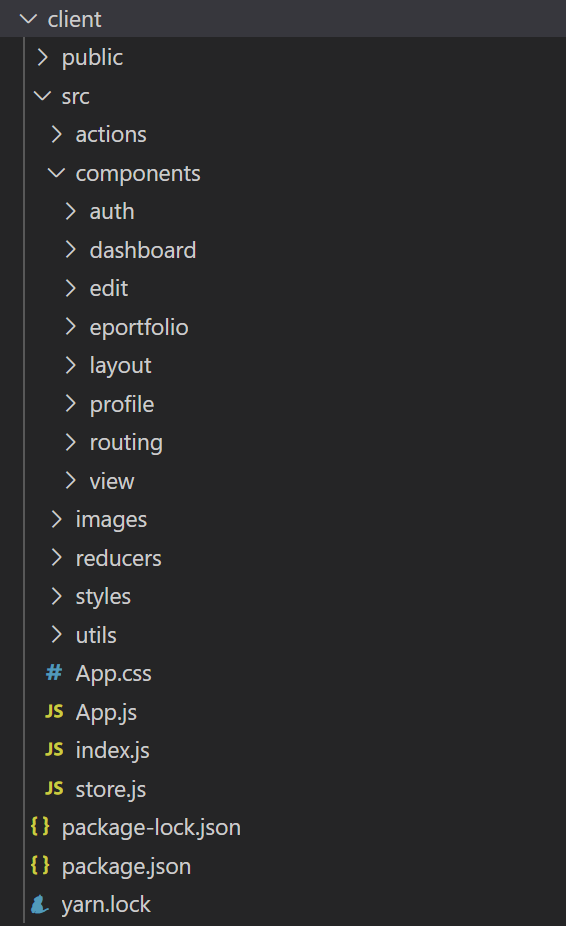
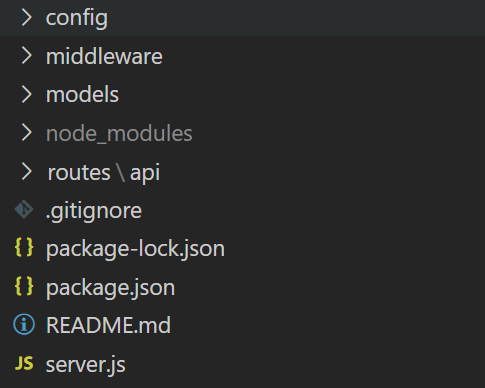
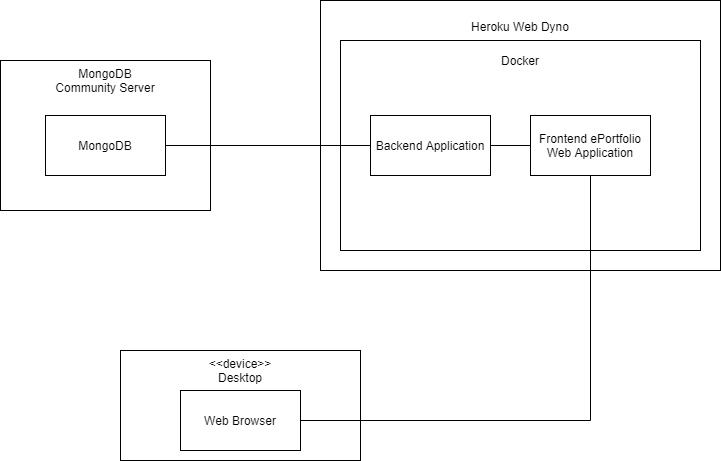
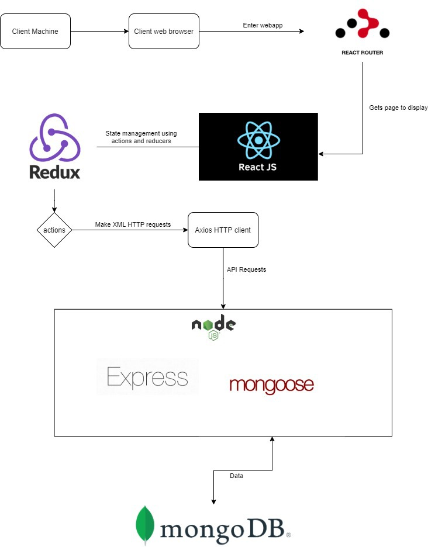
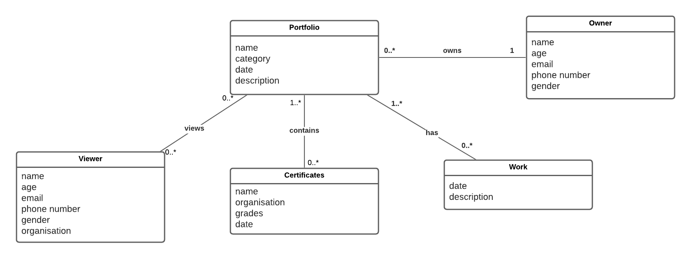
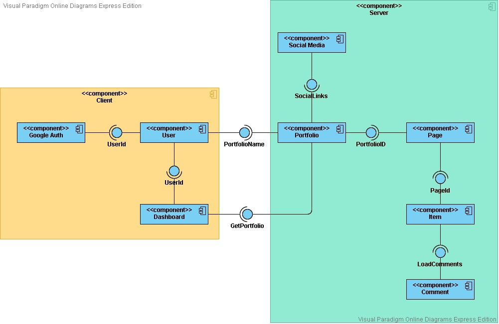
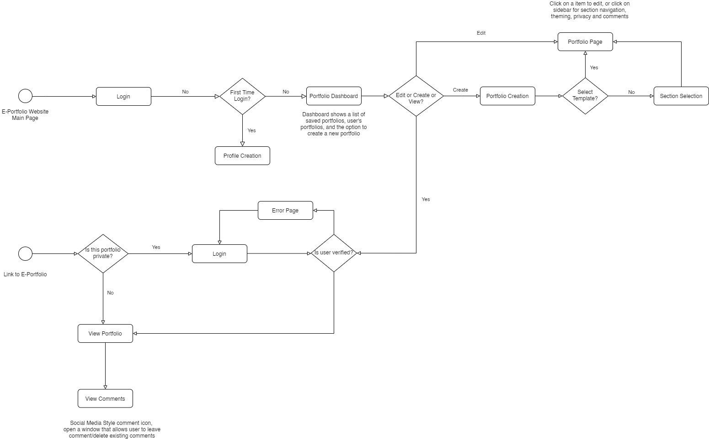
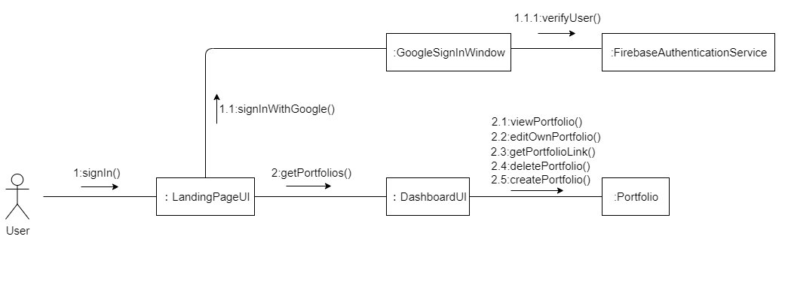
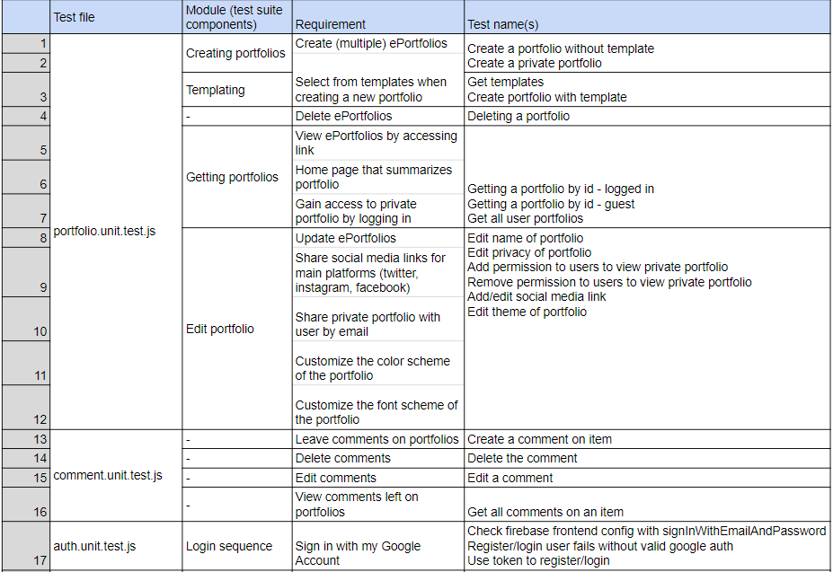
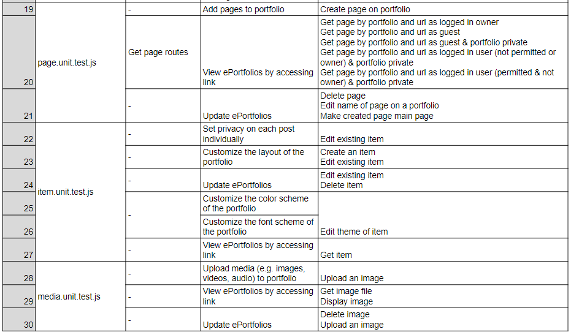

# Quaranteam Documentation  
## Table of contents  
- [User Documentation](#user-documentation)  
- [Frontend Documentation](#frontend-documentation)  
  - [Setup](#setup)  
  - [Technologies](#technologies)  
  - [Dependencies](#dependencies) 
  - [Frontend Structure](#frontend-structure)  
  - [Frontend Routes](#frontend-routes)  
- [Backend Documentation](#backend-documentation)  
  - [Setup](#setup)  
  - [Technologies](#technologies) 
  - [Dependencies](#dependencies)
  - [Backend Structure](#backend-structure)  
  - [Backend API Documentation](#backend-api-documentation) 
- [Miscellaneous Diagrams](#miscellaneous-diagrams)             
  - [Deployment diagram](#deployment-diagram)  
  - [Architecture diagram](#architecture-diagram) 
  - [Domain Class diagram](#domain-class-diagram)
  - [Component diagram](#component-diagram)  
  - [Process diagram](#process-diagram)         
  - [Communication diagram](#communication-diagram)         
  - [Traceability matrix](#traceability-matrix)                              
  - [Google Fonts](#google-fonts)                            
- [Deployment Guidelines](#deployment-guidelines)                    
  
               
# User Documentation      
Our User Documentation is a static website hosted using github pages and Jekyll.    
                                          
Comprehensive introduction of all features and design of our application is included there.                    
It also includes a search function to help users find needed information.            
                                                          
https://winnie76.github.io/Quaranteam/  

# Setup  
1.cd client   
2.npm install (automatically install all dependencies from client/package.json)   
3. cd .. and cd server
4.npm install

**How to run both server and client on localhost:**
1. npm run dev (from root folder)
  
# Frontend Documentation  
  
## Technologies  
React & Redux   
  
## Dependencies  
```javascript
"dependencies": {
    "@material-ui/core": "^4.11.0",
    "@material-ui/icons": "^4.9.1",
    "axios": "^0.20.0",
    "faker": "^5.1.0",
    "firebase": "^7.21.1",
    "firebaseui": "^4.6.1",
    "moment": "^2.24.0",
    "react": "^16.13.0",
    "react-dom": "^16.13.0",
    "react-firebaseui": "^4.1.0",
    "react-hook-form": "^6.8.6",
    "react-moment": "^0.9.7",
    "react-redux": "^7.2.0",
    "react-redux-firebase": "^3.7.0",
    "react-router-dom": "^5.1.2",
    "react-scripts": "^3.4.3",
    "redux": "^4.0.5",
    "redux-devtools-extension": "^2.13.8",
    "redux-thunk": "^2.3.0",
    "uuid": "^7.0.2"
  }
  ```
## Frontend Structure  
<p align="left">	
  	
</p>  

## Frontend Routes
http://localhost:3000/   
http://localhost:3000/dashboard  
http://localhost:3000/create-eportfolio  
http://localhost:3000/pick-template  
http://localhost:3000/about   
http://localhost:3000/contact   
http://localhost:3000/view/(id)/(pagename)   
http://localhost:3000/edit/(id)/(pagename)   
     
# Backend Documentation  
## Technologies  
Express

## Dependencies
```json
 "dependencies": {
    "axios": "^0.19.2",
    "bcryptjs": "^2.4.3",
    "client": "file:client",
    "config": "^3.3.1",
    "cors": "^2.8.5",
    "express": "^4.17.1",
    "express-validator": "^6.6.1",
    "firebase-admin": "^9.2.0",
    "gravatar": "^1.8.0",
    "jsonwebtoken": "^8.5.1",
    "mongoose": "^5.10.3",
    "normalize-url": "^5.0.0",
    "puppeteer": "^5.3.0",
    "react": "^16.13.1",
    "react-router-dom": "^5.2.0",
    "tough-cookie": "^4.0.0"
  }
  ```
## Backend Structure  
<p align="left">	
  	
</p>  

## Backend API Documentation  
https://documenter.getpostman.com/view/12626526/TVK5cgbD   

## Miscellaneous Diagrams

### Deployment diagram
	

### Architecture diagram
	

### Domain Class diagram
	

### Component diagram
	

### Process diagram
	

### Communication diagram


### Traceability matrix



## Google Fonts

This project uses Google Fonts to allow for portfolio customisation for users. The attributions for all fonts in Google Fonts can be found at this link below.
https://fonts.google.com/attribution

## Deployment Guidelines                             
                                                 
### 1.How to deploy the source code, database and run the project on a new server:                  
                                                                         
#### -Hosted Application Link                                     
The application was already deployed on Heroku and the hosted application link is https://eportfolio-quaranteam.herokuapp.com/                                                        

#### -How to deploy on a new server                              
A comprehensive introduction to deployment and available tools                            
https://vsupalov.com/deployment-intro/                             
(As there are many ways of deploying with different tools, e.g. Heroku, Codestar, Azure, they will not all be listed here.)                                           
                                   
### 2.Administrator login credentials for Heroku:                                
                                   
#### HEROKU_API_KEY
b22327e2-5774-4300-ad23-fcf8b6ea4a66                             
                      
#### HEROKU_APP_NAME                               
eportfolio-qauranteam                         
                             
#### To update HEROKU_API_KEY and HEROKU_APP_NAME                                
Go to SETTINGS of Quaranteam repository                                          
Then go to SECRETS                                          
Click UPDATE to update them                             
                                
For more information on Heroku Platform API, please visit https://devcenter.heroku.com/articles/platform-api-quickstart?fbclid=IwAR0WHhkSEUbGMSBZ46-cX7z6sIQOAWbokxxFveZ3FZ4T-ds0d8aIzOdDgwM         
                                           
                                                                    
### 3.Access to code repository, databases and server:                                                                                                
#### Code Repository                      
https://github.com/Arixeyenia/Quaranteam                                         
#### Database - MongoDB Atlas                                                                   
invite clients to MongoDB Atlas during handover                                
#### Heroku                     
invite clients during handover                           
#### Firebase google authentication                                  
invite clients during handover                                               
                                                               
### 4.Installation Instructions:                                             
#### Install web application locally (node.js should be installed already)                        
Go to https://github.com/Arixeyenia/Quaranteam which is the master branch of Quaranteam App       
CLONE the master branch                                
OPEN THE PROJECT FOLDER with any editor like VS Code                      
OPEN the terminal and TYPE ‘cd client’ then TYPE ‘npm install’                         
TYPE ‘cd ..’ to go back to the root directory                                     
TYPE ‘cd server’ and then TYPE ‘npm install’                       
Finally TYPE ‘npm run dev’ to run both client and server                    
Client runs at localhost:3000; Server runs at localhost:5000                          
                           
#### Run web application remotely                         
Open your browser and TYPE https://eportfolio-quaranteam.herokuapp.com/                                    
